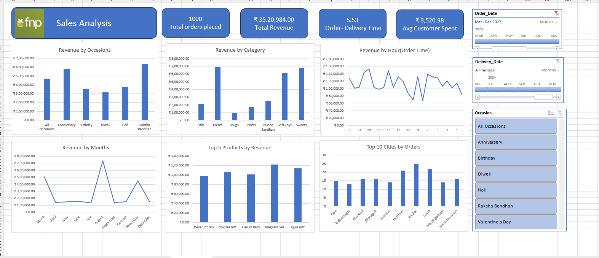

# FNP Sales Analysis Dashboard

An interactive Excel dashboard analyzing one year of e-commerce gifting sales data for FNP (Ferns N Petals) — covering revenue trends, top-performing occasions, product categories, cities, and delivery performance.



## Overview

This project turns a raw sales dataset (1,000 orders) into a single-screen, self-serve analytics dashboard built entirely in Microsoft Excel. It uses Pivot Tables, Pivot Charts, and interactive Slicers/Timelines to let a user filter by Occasion, Order Date, and Delivery Date, and instantly see how revenue and order volume shift across those dimensions.

## Key Metrics

| Metric | Value |
|---|---|
| Total Orders | 1,000 |
| Total Revenue | ₹35,20,984.00 |
| Avg. Order-to-Delivery Time | 5.53 days |
| Avg. Revenue per Customer | ₹3,520.98 |

## Key Insights

- **Seasonal demand is highly concentrated** — August alone drove roughly double the revenue of any other month, with a secondary spike in November, pointing to strong festive/occasion-led buying rather than steady month-on-month demand.
- **Raksha Bandhan and Anniversary are the top revenue-generating occasions**, together outperforming Birthday, Holi, and Diwali.
- **Sweets, Colors, and Soft Toys are the leading product categories** by revenue, while Mugs and Plants remain long-tail categories.
- **Order volume is spread across tier-2/tier-3 cities** — Imphal, Hardwar, and Kavali lead the top 10 cities by order count, suggesting demand beyond metro markets.
- **"Magnam Set" and "Dolores Gift" are the best-selling products** among the top 5 by revenue.
- **Revenue by hour-of-day is volatile with no single dominant peak**, indicating a broad, all-day ordering pattern rather than fixed "shopping hours."

## Dashboard Features

- KPI summary cards (orders, revenue, delivery time, avg. spend)
- Revenue by Occasion, Category, Month, and Hour of Order
- Top 5 Products by Revenue
- Top 10 Cities by Orders
- Interactive slicers for Order Date, Delivery Date, and Occasion

## Tools & Techniques

- **Microsoft Excel** — Pivot Tables & Pivot Charts
- **Slicers & Timelines** for interactive filtering
- Aggregation logic: SUM, AVERAGE, COUNT
- Dashboard design: single-screen layout, consistent color theme, currency/date formatting

## Repository Structure

```
fnp-sales-analysis/
├── README.md
├── FNP_Sales_Analysis_Dashboard.xlsx     # Full interactive dashboard
├── executive_summary.pdf                  # 1-page summary of findings
├── data/
│   └── sales_data.csv                     # Raw dataset used
└── screenshots/
    └── dashboard.png                      # Dashboard preview image
```

## How to Use

1. Download `FNP_Sales_Analysis_Dashboard.xlsx`
2. Open in Excel (slicers require Excel 2013+)
3. Use the Occasion, Order Date, and Delivery Date filters to explore the data interactively

